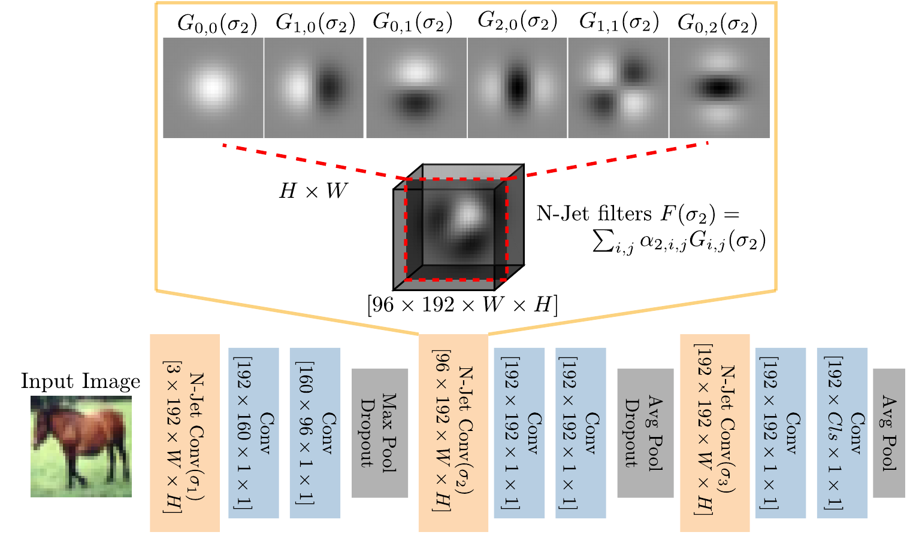

# N-JetNet


Implements the N-Jet layer from "Resolution learning in deep convolutional networks using scale-space theory", Silvia L.Pintea, Nergis Tomen, Stanley F. Goes, Marco Loog, Jan C. van Gemert, Transactions on Image Processing, 2021. (<a href="https://arxiv.org/abs/2106.03412">archive link </a>)


### Requirements
The code was tested on Linux (Ubuntu 18.04.5 LTS):
- python 3.6.9
- pytorch 1.0.0 (https://pytorch.org/) with additional packages:
    - tensorboard
    - torchvision    
- cuda 10.2

### Organization:

This code is organized as follows:
```
checkpoints/cifar10/nin_shared_srf  -- directory where trained models are saved (contains an example of trained NiN with structured N-Jet layer)
models/                             -- the pytorch layer definition of models
        nin.py                      -- an example of the original network-in-network (NiN) model
        nin_shared_srf.py           -- an example of using the structured N-Jet layer for the network-in-network (NiN) model 
srf                                 -- contains the structured N-Jet layer implementation
        gaussian_basis_filters.py   -- defines the Gaussian derivatives using the Hermite polynomials
        structured_conv_layer.py    -- defines the N-Jet structured convolutional layer (called SRF) using the Gaussian basis 
demo.py                             -- the "main" script that calls the network training
demo.sh                             -- the script running the demo and containing an example of hyper-parameters for the N-Jet layer
```

Third party software (the code is adapted from https://github.com/bearpaw/pytorch-classification):
```
utils                               -- code utilities
        eval.py                     -- evaluation code for computing the top-1/top-5 acurracy
dataset.py                          -- dataset creation (train/val/test) and loading 
train_and_test.py
```
All credit for third party sofware is with the authors.

The output will be saved in:
```
checkpoints/                        -- directory where trained models are saved
        cifar10/
                nin_shared_srf      -- contains an example of trained NiN with structured N-Jet layer)

```

### Usage
- Edit the ```demo.sh``` file to match the hyper parameters you want to use.
- Run ```bash demo.sh```

### Citation
If you use this code, please cite the publication:
```
@article{pintea2021resolution,
  title={Resolution learning in deep convolutional networks using scale-space theory},
  author={Pintea, Silvia L and Tomen, Nergis and Goes, Stanley F and Loog, Marco and van Gemert, Jan C},
  journal={TIP},
  doi={10.1109/TIP.2021.3115001},
  year={2021}
}
```

